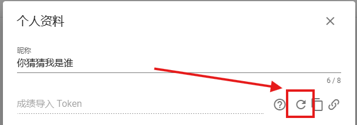
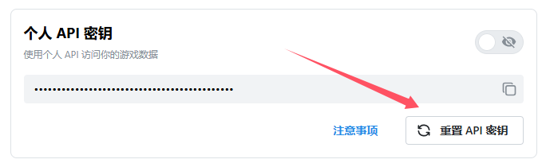
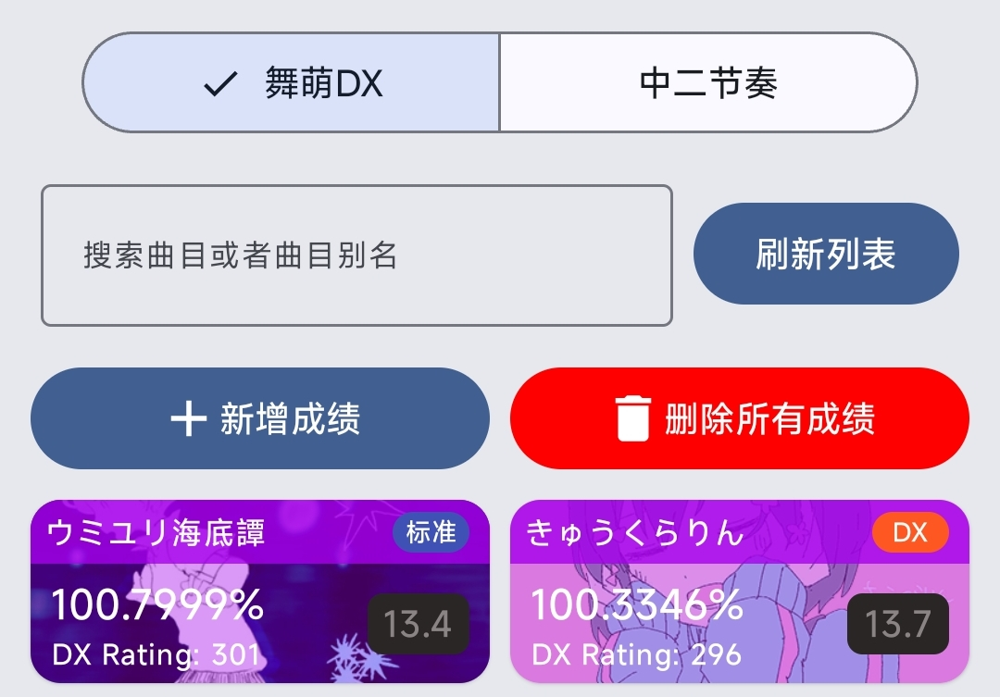

# MaiproberPlus-使用说明
---

##### 该工具基于: [落雪查分器](https://github.com/Lxns-Network/maimai-prober-frontend) 和 [水鱼查分器](https://www.diving-fish.com/maimaidx/prober/)
##### 文档版本: Ver-0.0.2

## 基础功能-导入成绩到查分器

- 水鱼API
    1. 打开水鱼查分器并登录, 点击 **"编辑个人资料"** 按钮
    2. 点击箭头指向的按键对成绩导入Token进行重置或生成 **(若你已有成绩导入Token, 请跳过此步)**
    
    4. 点击 ***重置Token旁边的按钮*** 来 **复制该Token** 并打开MaiproberPlus
    5. 接下来请看通用步骤
- 落雪API
    1. 打开落雪查分器并登录, 点击侧边栏中的 **"账号详情"** 按钮
    2. 点击箭头指向的按钮对个人API密钥进行重置或生成 **(若你已有个人API密钥, 请跳过此步)**
    
    3. 点击 ***重置API密钥上面的按钮*** 来 **复制该密钥** 并打开MaiproberPlus
    4. 接下来请看通用步骤
- 通用步骤
1. ***再次确认你需要导入的查分器以及 成绩导入Token / 个人API密钥 正确无误***
2. ***再次确认你需要导入的游戏 舞萌 / 中二节奏***
3. ***复制Hook链接后点击开始劫持 (第一次使用需要下载少量文件) 请求创建VPN连接时请同意 (重要!!)***
4. ***启动到微信, 并找一个安全的聊天窗口打开 (最好是发给你自己或文件传输助手)***
5. ***点进链接即可开始导入***

## 进阶功能-本地成绩管理

在MaiproberPlus中, 你可以选择将你的成绩导入进本地数据库, 以进行本地化成绩查询
若你需要使用本地成绩管理功能, 请在导入成绩时点击 **"本地"** 选择框, 并按正常步骤导入即可
或选择对应的查分器后, 点击 **"从选定的查分器获取数据"** 按钮, MaiproberPlus会自动从对应的查分器获取成绩
***这需要你设置好对应的 成绩导入Token / 个人API密钥 (重要!!)***

点击应用下方Dock栏的 **"成绩管理"** 按钮进入本地成绩管理页面, 这里以 ***舞萌DX*** 为例
1. 搜索曲目--可根据 **曲目名称 / 曲目别名** 搜索你的成绩
2. 新增成绩--可在你的 **本地数据库记录** 中新增一条成绩
3. 删除所有成绩--可删除你 **本地数据库记录** 中的所有成绩 

## 设置界面详解

1. Token设置--可分别设置 **成绩导入Token / 个人API密钥**
2. 成绩抓取设置--可分别设置 **舞萌 / 中二节奏** 的同步设置
    - 例如: ***只同步舞萌DX的 Master 难度 或 只同步中二节奏的 World's End 难度等***
3. 更新歌曲信息与别名--当游戏有 **版本更新** 时, 抓取最新的歌曲信息
4. 成绩缓存本地--设置是否每次上传到查分器时都缓存一份成绩到 **本地数据库**
5. 清除应用缓存--清除歌曲缩略图, ktor请求等缓存信息
